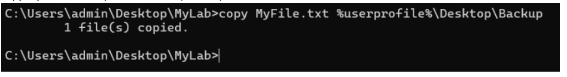

```
NAME : THIRUMALAI K
DEPT : AIML
REG NO : 212224240176

```


# Windows-basic-commands-batchscript
Ex08-Windows-basic-commands-batchscript

# AIM:
To execute Windows basic commands and batch scripting

# DESIGN STEPS:

### Step 1:

Navigate to any Windows environment installed on the system or installed inside a virtual environment like virtual box/vmware 

### Step 2:

Write the Windows commands / batch file
Save each script in a file with a .bat extension.
Ensure you have the necessary permissions to perform the operations.
Adapt paths as needed based on your system configuration.
### Step 3:

Execute the necessary commands/batch file for the desired output. 


# WINDOWS COMMANDS:
## Exercise 1: Basic Directory and File Operations
Create a directory named "MyLab" on the desktop.

```
mkdir %userprofile%\Desktop\MyLab
```


```
mkdir my-folder

```


```
rmdir my-folder

```


## COMMAND AND OUTPUT

Change to the "MyLab" directory and create an empty text file named "MyFile.txt" inside it.
```
mkdir %userprofile%\Desktop\MyLab
```


```
COPY CON Rose.txt
A clock in a office can never get stolen
Too many employees watch it all the time


```


```
dir Rose.txt

```


```
echo hello world > hello.txt

```


```
type hello.txt
copy hello.txt hello1.txt
del hello1.txt

```


## COMMAND AND OUTPUT

List the contents of the "MyLab" directory.
```
cd %userprofile%\Desktop\MyLab
```


```
type nul > MyFile.txt
```

```
assoc | more

```


```
fc hello.txt Rose.txt

```


## COMMAND AND OUTPUT

Copy "MyFile.txt" to a new folder named "Backup" on the desktop.
```
dir %userprofile%\Desktop\MyLab
```


## COMMAND AND OUTPUT

Move the "MyLab" directory to the "Documents" folder.
```
mkdir %userprofile%\Desktop\Backup
```


```
copy MyFile.txt %userprofile%\Desktop\Backup
```


## COMMAND AND OUTPUT
```
mkdir %userprofile%\Desktop\Documents
```


## Exercise 2: Advanced Batch Scripting
Create a batch script named "BackupScript.bat" that creates a backup of files with the ".docx" extension from the "Documents" folder to a new folder named "DocBackup" on the desktop.


## OUTPUT

## 1.BAT:
```
@echo off
set name=John
echo Hello, %name%!
pause


```


## 2.BAT
```
@echo off
:main
set /p number=Enter a number: 
set /a remainder=%number% %% 2
if %remainder%==1 (
    echo %number% is an odd number.
) else (
    echo %number% is not an odd number.
)
:choice
set /p continue=Do you want to check another number? (Y/N): 
if /i "%continue%"=="Y" goto main
if /i "%continue%"=="N" goto end
echo Invalid choice, please enter Y or N.
goto choice
:end
echo Thank you for using the odd number checker!
pause

```


## 3.BAT

```
@echo off
for %%i in (1 2 3 4 5) do (
    echo Number: %%i
)
pause


```


## 4.BAT

```
@echo off
echo Reading lines from sample.txt...
for /f "tokens=*" %%i in (sample.txt) do (
    echo Fruit: %%i
)
pause

```


## 5.BAT

```
@echo off
echo Displaying Even or Odd for numbers 1 to 10
for /l %%i in (1,1,10) do (
    set /a rem=%%i %% 2
    if %%i %% 2 == 0 (
        echo %%i is Even
    ) else (
        echo %%i is Odd
    )
)
pause

```


# RESULT:
The commands/batch files are executed successfully.

